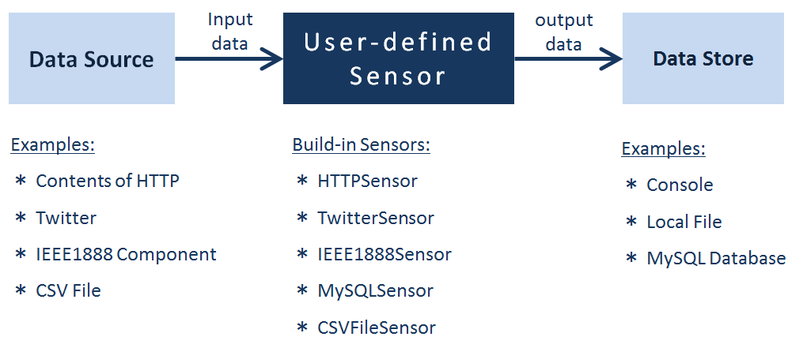

=====================
Architecture Overview
=====================

Components
==========

User-defined Sensor
-------------------

A User-defined Sensor (UDS) crawls event data
--- that has time of occurrence and site of occurrence ---
from a data source,
converts that data into the :class:`uds.data.M2MData` object,
and then saves it to a data store.

Data Source
-----------

A data source provides input data for a UDS to crawl.
A UDS can handle any type of data source --- you just need to override the
:meth:`uds.sensors.base.Sensor.fetch` method with your *MySensor* implementation for accessing it.

The built-in sensor templates support the following types of data sources.

============================  ======================  =============================
Data Source                   Crawling protocol etc.  Input Data Format
============================  ======================  =============================
Web Contents                  HTTP                    String data (e.g HTML, XML)
Twitter                       Twitter Streaming API   Status object of tweet as dictionary
IEEE1888 Component            IEEE1888                IEEE1888 response data object
MySQL Database                MySQL Connection        List of query response
Local CSV File                File IO                 List of CSV data row
============================  ======================  =============================

Data Store
----------

A data store provides an output location for data from a UDS.
A UDS is expected to be able to handle the following types of data stores.

======================  ==========================================
Data Store              Output Data Format
======================  ==========================================
Console（for debug）    M2M Data Format (as JSON String)
Local File              M2M Data Format (as JSON String)
MySQL Database          M2M Data Format (as RDB Table Data）
======================  ==========================================

You can override the :meth:`uds.sensors.base.Sensor.store` method
in your *MySensor* implementation to support arbitrary data stores,
but in this case, built-in store safe features are not ensured.

The Data Sensing Process Overview
=================================

UDS operates in the following process.

#.  **open connection** 　--　 opens I/O connections to data source and data store.

#.  **fetch contents** 　--　 retrieves HTML and other content with the requested data from the data source.

#.  **parse contents** 　--　 extracts data from the fetched content and converts it into M2M Data (for output).

#.  **check data** 　--　 confirms that there are no errors in the extracted M2M data.

#.  **filter data** 　--　 de-duplicates the extracted M2M data.

#.  **store data** 　--　 outputs the M2M data to a specified location.

#.  The process repeats (from step 2) until end-of-crawl conditions are met.

#.  **close connection** 　--　 close I/O connections to data source and data store.

See :doc:`/topics/sensors/intro` for more information.

Open-Source Libraries and Implementations
=========================================

*   Open-source libraries
        The **uds-sdk** library is provided under an open-source license.

*   Open-source User specific implementation
        You can provide your own sensor project under an open-source license.