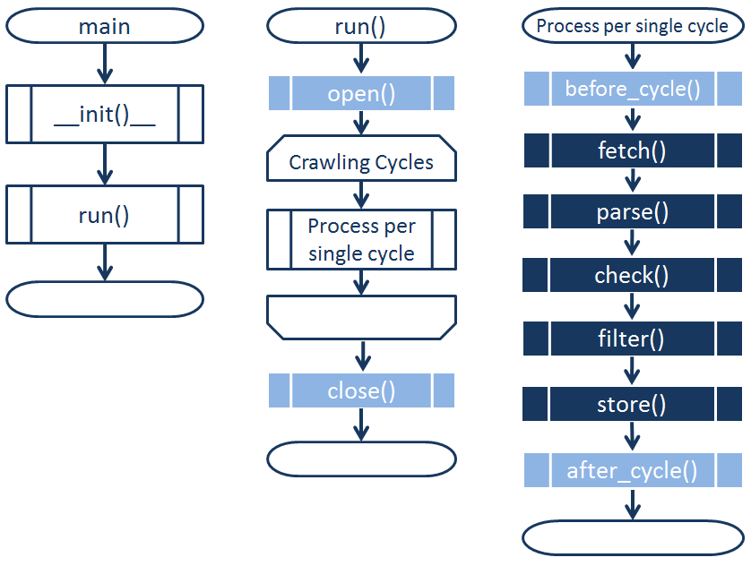

======================
Before You Get Started
======================

.. contents::
   :depth: 2

**Related topics**
    *   :doc:`/topics/architecture`

As above tutorial, you can extend suitable Sensor Template Class
to create your own sensor (*MySensor*) classes,
and can customize your *MySensor* in the following way

*   Configuring parameters of sensor template.

*   Overriding abstract methods of sensor template.

In this section, *The Data Sensing Process* and *Types of Sensor Templates*
those are fundamental knowledge to customize *MySensor* are explained.

The Data Sensing Process
------------------------

The following flowchart shows how sensors operate.

This data sensing process primarily comprises the following five steps,
which run in order during each crawl cycle.

#.  :meth:`~uds.sensors.base.Sensor.fetch` 　--　 retrieves HTML and other content with the requested data from the data source.

#.  :meth:`~uds.sensors.base.Sensor.parse` 　--　 extracts data from the fetched content and converts it into M2M Data (for output).

#.  :meth:`~uds.sensors.base.Sensor.check` 　--　 confirms that there are no errors in the extracted M2M data.

#.  :meth:`~uds.sensors.base.Sensor.filter` 　--　 de-duplicates the extracted M2M data.

#.  :meth:`~uds.sensors.base.Sensor.store` 　--　 outputs the M2M data to a specified location.

The following auxiliary initialization, pre-processing, and post-processing functions are also run.

#.  :meth:`~uds.sensors.base.Sensor.__init__` 　--　 initializes the sensor and configures runtime parameters.

#.  :meth:`~uds.sensors.base.Sensor.open` 　--　 handles processing before the crawl cycle begins, opens I/O connections, and so on.

#.  :meth:`~uds.sensors.base.Sensor.before_cycle` 　--　 runs at the beginning of each cycle.

#.  :meth:`~uds.sensors.base.Sensor.after_cycle` 　--　 runs at the end of each cycle.

#.  :meth:`~uds.sensors.base.Sensor.close` 　--　 handles processing after the crawl cycle begins, closes I/O connections, and so on.

Types of Sensor Templates
-------------------------

As shown in the following table, the UDS SDK has 6 built-in sensor templates.
You can extend these templates as necessary to create your own sensor classes.

Template Descriptions
:::::::::::::::::::::

+-------------------------------------------------+-----------------------------------------------------------------------------------------+
|Template Class                                   | Description                                                                             |
+=================================================+=========================================================================================+
|:doc:`Sensor<base>`                              | The common (base) template.                                                             |
+----+--------------------------------------------+-----------------------------------------------------------------------------------------+
|    |:doc:`HttpSensor<http>`                     | Collects HTML content from web pages and other sources using HTTP GET and POST methods .|
+    +--------------------------------------------+-----------------------------------------------------------------------------------------+
|    |:doc:`TwitterSensor<twitter>`               | Fetches Tweet data from Twitter using the Twitter Streaming APIs.                       |
+    +--------------------------------------------+-----------------------------------------------------------------------------------------+
|    |:doc:`IEEE1888Sensor<ieee1888>`             | Fetches data using the IEEE 1888 protocol for transfer                                  |
|    |                                            | sensing data and control data.                                                          |
+    +--------------------------------------------+-----------------------------------------------------------------------------------------+
|    |:doc:`MySQLSensor<mysql>`                   | Reads MySQL data.                                                                       |
+    +--------------------------------------------+-----------------------------------------------------------------------------------------+
|    |:doc:`CSVFileSensor<csvfile>`               | Reads local CSV file data.                                                              |
+----+--------------------------------------------+-----------------------------------------------------------------------------------------+

Template Comparisons
::::::::::::::::::::

+-------------------------------------------------+-------------------------------+-------------------------------+-------------------------------+
|Template Class                                   | fetch method                  | parse method                  | store method                  |
+=================================================+===============================+===============================+===============================+
|:doc:`Sensor<base>`                              |Not implemented `*2`           |Not implemented `*2`           |Selectable output location `*1`|
+----+--------------------------------------------+-------------------------------+-------------------------------+-------------------------------+
|    |:doc:`HttpSensor<http>`                     |Supports HTTP(GET/POST)        |Not implemented `*2`           |Selectable output location `*1`|
+    +--------------------------------------------+-------------------------------+-------------------------------+-------------------------------+
|    |:doc:`TwitterSensor<twitter>`               |Supports the Twitter           |Not implemented `*2`           |Selectable output location `*1`|
|    |                                            |Streaming APIs                 |                               |                               |
+    +--------------------------------------------+-------------------------------+-------------------------------+-------------------------------+
|    |:doc:`IEEE1888Sensor<ieee1888>`             |Supports IEEE 1888 (SOAP)      |Not implemented `*2`           |Selectable output location `*1`|
+    +--------------------------------------------+-------------------------------+-------------------------------+-------------------------------+
|    |:doc:`MySQLSensor<mysql>`                   |Supports MySQL                 |Not implemented `*2`           |Selectable output location `*1`|
+    +--------------------------------------------+-------------------------------+-------------------------------+-------------------------------+
|    |:doc:`CSVFileSensor<csvfile>`               |Supports local CSV file input  |Not implemented `*2`           |Selectable output location `*1`|
+----+--------------------------------------------+-------------------------------+-------------------------------+-------------------------------+

| `*1`　You can choose Console, File, MySQL, EvWH, SCN as the output location.
| `*2`　Implemented by subclasses (e.g. MySensor).

|

UDS Project Structure
---------------------
Sensors run in a project directory like the following.
You can use the uds command to create projects (see :doc:`/topics/cli`).
::

    project-name
        |─ _cache
        |─ _log
        |─ _out
        |─ conf
        |   └─ project_conf.py
        └─ examples
        |   └─ sensors
        |       |─ ExampleCSVFileSensor.py
        |       |─ ExampleHttpSensor.py
        |       └─ (Other examples)
        └─ udsimpl
            └─ sensors

========================= =======================
Directory                 Description
========================= =======================
_cache                    Saves cache files for the embedded *Geocoder* utility.
_log                      Saves output to your sensor’s runtime log.
_out                      Saves output data if you chose “File” as your sensor’s output location.
conf                      Saves files with common project settings.
examples                  Saves source code of example implementation.
udsimpl/sensors           Saves your sensor's source code.
========================= =======================

